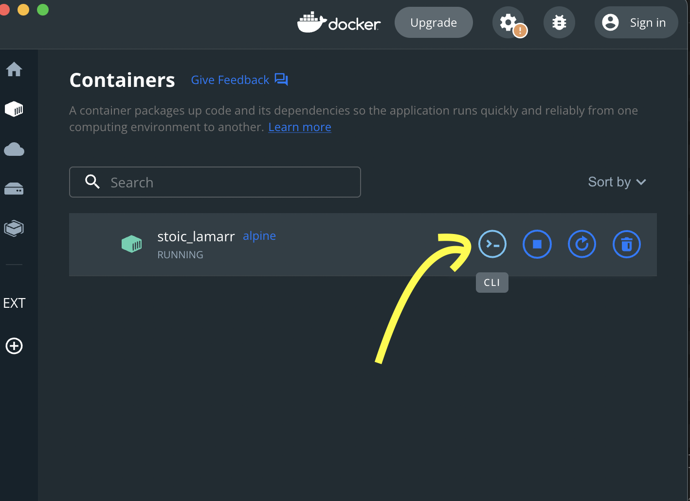
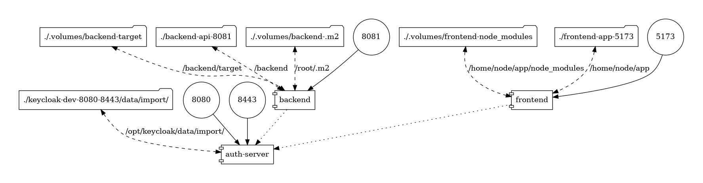

= Docker sur le poste du développeur
:author: Marc Bouvier
:revealjs_controls: true
:revealjs_progress: true
:revealjs_hash: true
:revealjs_theme: solarized
:revealjs_margin: 0.2

== Docker

"Docker est une plateforme permettant de lancer certaines applications dans des conteneurs logiciels."
-- Wikipedia, https://fr.wikipedia.org/wiki/Docker_(logiciel)[Docker (logiciel)]

=== Docker Compose

"Docker Compose est un logiciel pour définir et exécuter des applications à partir de multiples conteneurs.
Il est basé sur un fichier YAML qui permet de définir les services et les paramètres de leurs créations et ainsi de les démarrer par une commande unique."
-- Wikipedia, Docker (logiciel) : https://fr.wikipedia.org/wiki/Docker_(logiciel)#Outils_associ.C3.A9s[Outils associés]

=== Docker Hub

Catalogue d'images docker.

https://hub.docker.com/[hub.docker.com]

=== Ouvrir un terminal dans un container

[source,shell]
----
docker run -it --rm alpine
----

Dans Docker Desktop

== Cas d'utilisation 1/2

[.notes]
--
Docker et docker-compose peuvent être utiles au quotidien pour les développeurs.
--

* Utiliser des outils sans les installer
* Tester un logiciel compliqué à installer
* Test containers
* Reproduire la CI en local
* Environnements de développement conteneurisés

=== Cas d'utilisation 2/2

* Lancer des logiciels dont on ne connaît pas la technologie
* Tester une nouvelle version d'un langage
* Être admin dans un container
* Infrastructure éphémère
* Bac à sable
* Simuler l'environnement cible en local

== 01 Utiliser des outils sans les installer

[.notes]
--
* Éviter de polluer son environnement
--

* base de données
* serveur d'authentification

=== RabbitMq — installation classique

Installation classique de RabbitMq

image::./assets/rabbitmq_manual_installation.gif[]

=== RabbitMq — lancement avec docker

[source,yml]
----
include::../docker-compose.yml[tag=01-rabbitmq]
----

[source,shell]
----
docker compose up 01-rabbitmq
----

http://localhost:15672

=== Asciidoctor

[.notes]
--
Asciidoctor est un format de markup.
C'est aussi un outil qui permet de générer du contenu.
--

- html
- pdf
- slides
- ebook

=== Démo Asciidoctor

Ces slides footnote:[https://github.com/baldir-fr/bbl-docker-pour-le-developpeur]

`docker-compose.yml`

[source,yml]
----
include::../docker-compose.yml[tag=01_slides]
----

[source,shell]
----
docker compose run build-slides
----

== 02 Tester un logiciel compliqué à installer

[.notes]
--
* Par exemple **Gitlab (nécessite beaucoup de mémoire)
** Nextcloud
* Pratique pour jouer avec la configuration
--

=== Démo Nextcloud + PostgreSQL

[source,yml]
----
include::../02-tester-logiciel-compliqué/nextcloud/docker-compose.yml[]
----

[source,shell]
----
docker compose -f 02-tester-logiciel-compliqué/nextcloud/docker-compose.yml up
----

http://localhost:80

== 03 Test Containers

[.notes]
--
* lance un conteneur juste le temps des tests
* bases de données
* Nginx
* rabbitMq
--

https://www.testcontainers.org/[testcontainers.org]

=== Spring Boot + TestContainers + Redis 1/2

[source,java]
----
include::../03-test-containers/spring-boot/src/test/java/com/example/AbstractIntegrationTest.java[tag=03-test-containers-01]
----

=== Spring Boot + TestContainers + Redis 1/2

[source,java]
----
include::../03-test-containers/spring-boot/src/test/java/com/example/DemoControllerTest.java[tag=03-test-containers-02]
----

=== Démo

[source,shell]
----
cd 03-test-containers/spring-boot/
./gradlew build
----

https://github.com/baldir-fr/bbl-docker-pour-le-developpeur/tree/main/03-test-containers/spring-boot

== 04 Reproduire la CI en local

[.notes]
--
Lancer des scripts sur le même environnement que la CI
--

== 05 Environnements de développement conteneurisés

[.notes]
--
* Vs code remote
* Gitpod
* Code Server
--

=== Code Server

https://github.com/coder/code-server

Editeur de code pré-configuré sur le navigateur.

=== Démo

[source,yml]
----
include::../docker-compose.yml[tag=05-code-server]
----

[source,shell]
----
docker compose up -d 05-code-server
----

http://localhost:8094

== 06 Lancer des logiciels dont on ne connaît pas la technologie

[.notes]
--
* Par exemple springboot si on fait du JavaScript
* Keycloak
* ffmpeg + imagemagick
--

https://github.com/docker/awesome-compose[Awesome Docker Compose] starters

=== Conversion de .mov en .gif

https://toub.es/2017/09/11/high-quality-gif-with-ffmpeg-and-docker/

[source,shell]
----
alias video2gif='sudo docker run -v=`pwd`:/tmp/ffmpeg kafebob/video2gif'
----

[source,shell]
----
video2gif rabbitmq_manual_installation.mov rabbitmq_manual_installation.gif
----

== 07 Tester une nouvelle version d'un langage

[.notes]
--
* (ex. java 11 java 17..)
--

=== Java 8

[source,yml]
----
include::../docker-compose.yml[tag=07_java_8]
----

[source,shell]
----
docker compose run 07-movie-rental-java-8
----

=== Java 17

[source,yml]
----
include::../docker-compose.yml[tag=07_java_17]
----

[source,shell]
----
docker compose run 07-movie-rental-java-17
----

== 08 Être admin dans un conteneur

[.notes]
--
* quand on n'est pas admin de sa machine sur Windows par exemple
--

* installer des paquets sur une image

== 09 Infrastructure éphémère

[.notes]
--
Lancer un serveur pour le temps d'un événement * Pour un événement donné, lancer un serveur * Le supprimer à la fin de l'événement * Permet aux participants d'accéder à l'outil sans s'inscrire par exemple (les données sont supprimées à la fin de l'événement)
--

=== Tiddlywiki

[source,yml]
----
include::../docker-compose.yml[tag=09_tiddlywiki]
----

[source,shell]
----
docker compose up -d 09-tiddlywiki
----

http://localhost:8082

== 10 Bac à sable

[.notes]
--
* Expérimenter sans risques
* Essayer des choses risquées dans un environnement safe
* apprendre les commandes linux sans tout casser
** sous réserve de certaines précautions
--

=== Apprendre les commandes linux

https://hub.docker.com/_/busybox[Busybox] : https://en.wikipedia.org/wiki/BusyBox#Commands[Commandes disponibles]

[source,shell]
----
docker run -it --rm busybox
----

https://hub.docker.com/_/alpine[Alpine]

[source,shell]
----
docker run -it --rm alpine
----

== 11 Simuler l'environnement cible en local

[.notes]
--
* ex depuis windows exécuter sur linux
--

=== Keycloak + Vuejs + Spring-boot 1/2

[source,yml]
----
include::../11-simuler-environnement-cible/docker-for-local-development-bbl-main/docker-compose.yml[]
----

[source,shell]
----
docker compose -f 11-simuler-environnement-cible/docker-for-local-development-bbl-main/docker-compose.yml up -d
----

http://kubernetes.docker.internal:8080

http://kubernetes.docker.internal:5173

=== Keycloak + Vuejs + Spring-boot 2/2

[source,shell]
----
docker run --rm -it --name dcv -v $(pwd):/input pmsipilot/docker-compose-viz render -m image -f docker-compose.yml
----

== 🙏 Merci

Des questions?
🖐