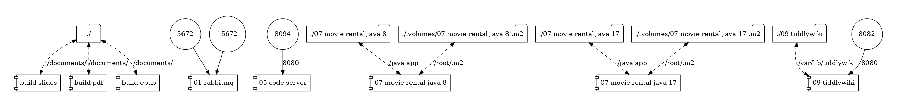

= Docker sur le poste du développeur

* https://baldir-fr.github.io/bbl-docker-pour-le-developpeur[Les slides en live]
* link:docs/bbl-docker-pour-le-developpeur.pdf[Version PDF]
* link:docs/bbl-docker-pour-le-developpeur.epub[Version Epub]

== Pré-requis pour construire les exemples

* Docker Engine 19.03.0+
* Docker compose

Optionnel

* GNU Make

== Génération des slides

[source,shell]
----
docker compose run build-slides
# Ou avec GNU Make
make 01-slides
----

== Génération du Pdf

[source,shell]
----
docker compose run --rm build-slides; rm -rf docs/assets;cp -r 01-slides/assets docs/
# Ou avec GNU Make
make 01-pdf
----

== Génération du E-book

[source,shell]
----
docker compose run build-epub
# Ou avec GNU Make
make 01-epub
----

== Générer le diagramme de docker compose

[source,shell]
----
docker run --rm -it --name dcv -v $(pwd):/input pmsipilot/docker-compose-viz render -m image -f docker-compose.yml
----

== Démos

=== RabbitMQ

[source,shell]
----
docker compose up 01-rabbitmq
----

* interface de management :
http://localhost:15672
** guest / guest
* localhost:5672

=== Nextcloud + postgreSQL

[source,shell]
----
docker compose -f 02-tester-logiciel-compliqué/nextcloud/docker-compose.yml up
----

* http://localhost:80
** admin / admin

=== TestContainers

[source,shell]
----
cd 03-test-containers/spring-boot/
./gradlew build
----

=== Code Server

[source,shell]
----
docker compose up -d 05-code-server
----

* http://localhost:8094

=== Conversion de .mov en .gif

[source,shell]
----
alias video2gif='sudo docker run -v=`pwd`:/tmp/ffmpeg kafebob/video2gif'
video2gif source_video.mov target_video.gif
----

=== Movie Rental Java 8

[source,shell]
----
docker compose run 07-movie-rental-java-8
----

=== Movie Rental Java 17

[source,shell]
----
docker compose run 07-movie-rental-java-17
----

=== Tiddlywiki

[source,shell]
----
docker compose up -d 09-tiddlywiki
----

* http://localhost:8082

=== Busybox

[source,shell]
----
docker run -it --rm busybox
----

=== Alpine

[source,shell]
----
docker run -it --rm alpine
----

=== Vuejs + Keycloak + Spring-Boot

`etc/hosts`

[source]
----
127.0.0.1 kubernetes.docker.internal
----

[source,shell]
----
docker compose -f 11-simuler-environnement-cible/docker-for-local-development-bbl-main/docker-compose.yml up -d
----

* Keycloak : http://kubernetes.docker.internal:8080
* Frontend VueJS :
http://kubernetes.docker.internal:5173
* Backend Spring-boot : http://kubernetes.docker.internal:8081

== Ressource complémentaires

* https://github.com/asciidoctor/docker-asciidoctor/blob/main/README.adoc[docker-asciidoctor]
* https://docs.asciidoctor.org/asciidoctor/latest/cli/:[Asciidoc CLI]
* https://docs.asciidoctor.org/reveal.js-converter/latest/converter/features/[Asciidoctor revealjs — écrire une présentation]
* https://docs.asciidoctor.org/reveal.js-converter/latest/converter/revealjs-options/[Asciidoctor revealjs — configurer revealjs]
* https://docs.asciidoctor.org/asciidoc/latest/directives/include-tagged-regions/#tagging-regions[Asciidoctor — inclure des snippets à l'aide de régions]

